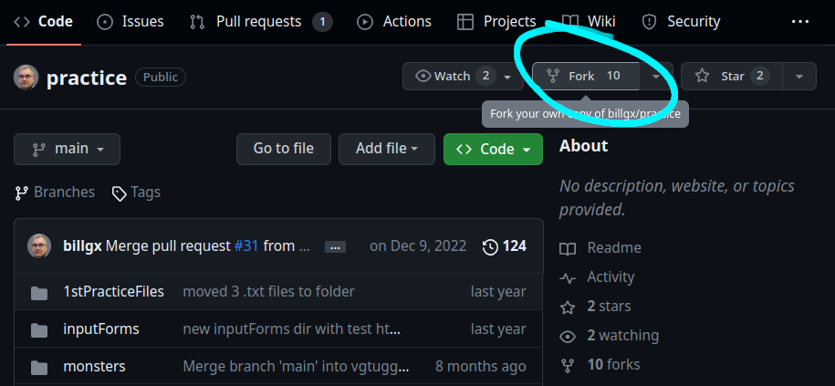

# How to Make a Pull Request on a Public Repo

If you are not an active contributor to a project on GitHub, you may still submit a pull request to open source projects and public repos using the following steps.

## Fork the Repo

Using this repository as an example, navigate to [the repositories main page](https://github.com/billgx/practice) and click the "Fork" button in the upper right hand portion of the page.



GitHub will navigate you to a page confirming the creation of the new forked repository within your own account. If you wish to change the name of the repository or if the name isn't available (because you already have a repository of that name) change the name of the repository, otherwise click confirm.

## Clone the Repo

To clone the repo, enter the following command into you're command line or terminal emulator after navigating to an appropriate directory on your system.

```
git clone https://github.com/<you're username>/practice.git
```

Then cd into the newly created directory

```
cd practice
```

## Create a New Branch

Create and checkout a new branch within this repo, for this example I will name this new branch "pr-practice". This can be done in two separate commands or more succinctly in a single command:

```
git branch pr-practice
git checkout pr-practice

// Or the single command

git checkout -b pr-practice
```

## Create a New Upstream Remote Repo

Add the original repo as the upstream repo

```
git remote add upstream https://github.com/billgx/practice.git
```

## Make Changes to the Repo

Now you may make whatever changes you desire to the repo. Add files, edit files, remove files, whatever you see fit. If the changes you make to the repo are undesirable, the owner of the repo will not merge them into the project. So make changes wisely, and be prepared to explain and justify the changes, additions and/or deletions you choose to make.

## Add, Commit, and Push

After you have made the desired changes, use `git add .` to easily stage all files that have been modified in the local repository. Then commit the changes using the following command

```
git commit -m "New text file added"
```

This command adds a commit to the repository and bind a message to it. The message being the content between the quotes. Commit messages are an important aspect of collaborative workflows and there is a certain etiquette when forming them. There have been many articles written surrounding this topic and I highly recommend you read some of them if you plan to work on professional projects.

You may now push the commit to the remote repository using the following

```
git push -u origin pr-practice
```

## Compare & Pull Request

Now that you have pushed the commit, if you navigate back to the repository page on GitHub, you will see a green button saying **Compare & pull request**, clicking this will take you to a page that ask you properly create your pull request. It is here that you will justify the changes you have made to the project. Be sure to be clear and thorough in this explanation if you wish for your change to merged into the main branch. Press the **Create pull request** when you have finished.

Now the owner of the repo can review the changes you have made and determine if they would like to merge your changes into the main branch.
